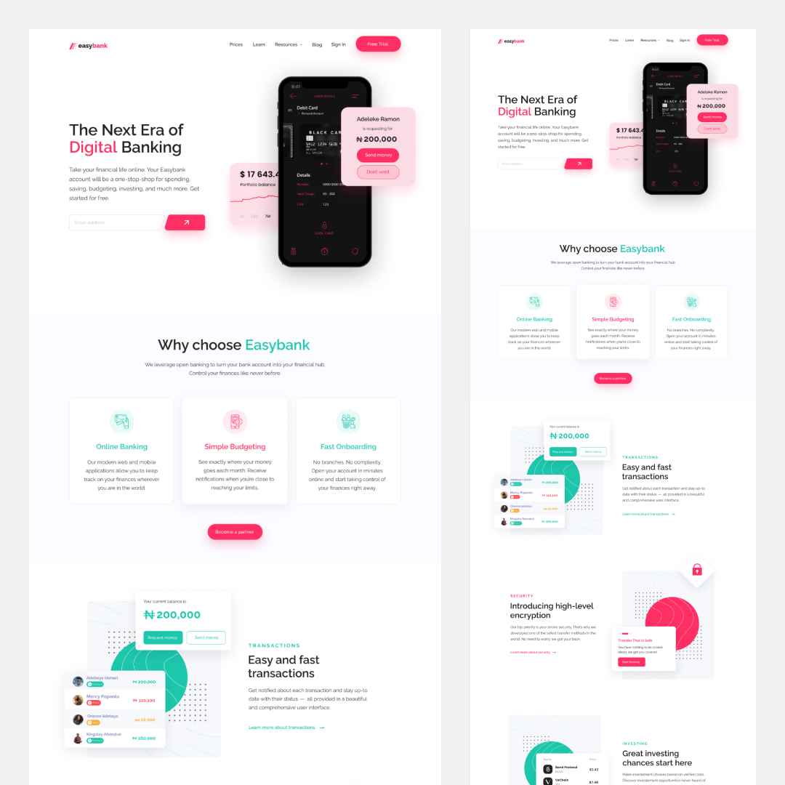

# Easybank - Featuring Gastby, Contentful and GraphQL

## The Challenge⚡️

I designed this landing page and wanted to build it using a headless CMS that I've never tried before, which was Contentful in this case. This is also my first experience with Gatsby (as a NextJS developer).

After trying Gastby, I must say that it was pretty satisfying to work with, although I still prefer NextJS. Anyways, this was the challenge:

- View the optimal layout for each page depending on the device's screen size
- Providing all the content from contenful (images, titles, descriptions etc.)
- Implementing a working testimonial slider on smaller screen sizes
- Seeing beautiful scroll & css animations

## Built With ✨

- [GraphQL](https://graphql.com) - Query language
- Contentful - Headless CMS
- [React](https://reactjs.org/) - JS library
- [Gatsby.js](https://www.gatsbyjs.com/) - React framework
- Typescript
- AOS - animation library

**Thanks for sharing** 🚀
